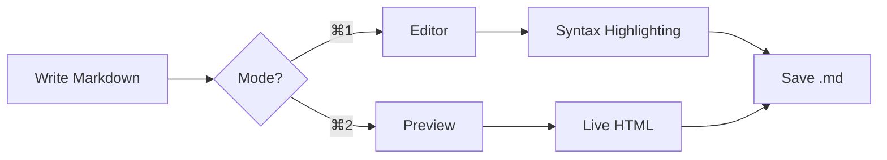
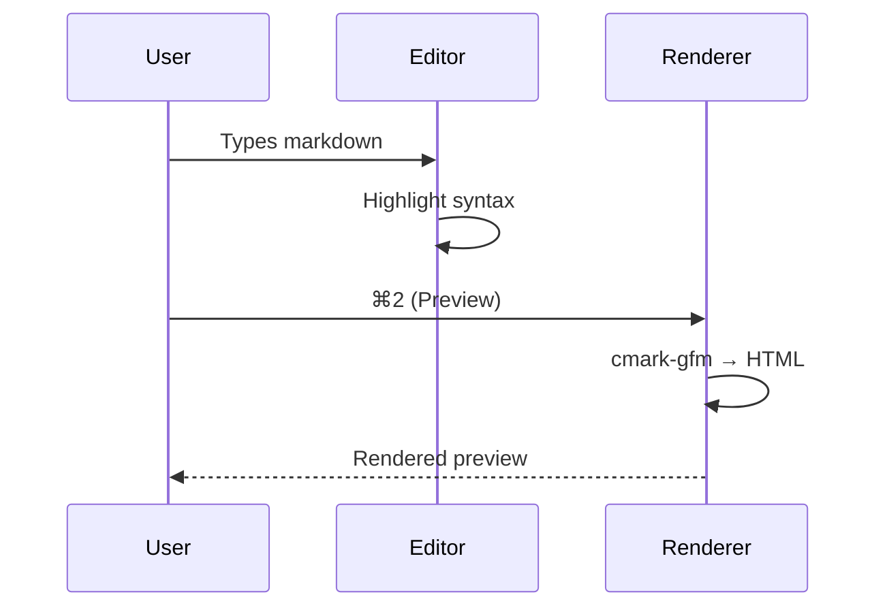

# Welcome to Clearly

A **native macOS markdown editor** built with SwiftUI — fast, focused, and beautifully rendered. Write in markdown, switch to a live preview, and let Clearly handle the rest.

> "The best tool is the one that gets out of your way." — *somebody, probably*

[TOC]

---

## Writing & Formatting

Clearly supports the full range of markdown formatting. Write in **bold**, *italic*, ***bold italic***, or ~~strikethrough~~. Combine them inline: this sentence has **bold with *nested italic* inside** for emphasis.

Use `inline code` for short snippets, variable names like `NSTextStorage`, or file paths like `~/Desktop/notes.md`.

Links look like this: [Clearly on GitHub](https://github.com/Shpigford/clearly), and autolinked URLs work too: https://apple.com.

### Highlight

Use ==double equals== to ==highlight important text==. Great for drawing attention to key points.

### Superscript & Subscript

Water is H~2~O. Einstein's famous equation: E = mc^2^.

The formula for the area of a circle is A = πr^2^, and CO~2~ levels are rising.

### Emoji Shortcodes

Clearly supports GitHub-style emoji shortcodes: :rocket: :fire: :sparkles: :tada: :heart: :100:

Ship features :ship:, fix bugs :bug:, and celebrate :champagne:!

---

## Lists

### Unordered

- First item
- Second item
  - Nested item
  - Another nested item
    - Even deeper
- Third item

### Ordered

1. Draft the idea
2. Write it down
3. Ship it
   1. Build
   2. Test
   3. Release

### Task List

- [x] Open a markdown file
- [x] See beautiful syntax highlighting
- [x] Render a live preview
- [ ] Tell all your friends

*Tip: In preview mode, you can click the checkboxes to toggle them!*

---

## Blockquotes

> Simplicity is the ultimate sophistication.
>
> > Nested blockquotes work too — useful for threaded replies or layered citations.
>
> — Leonardo da Vinci

---

## Callouts & Admonitions

Clearly supports GitHub/Obsidian-style callouts with `> [!TYPE]` syntax:

> [!NOTE]
> This is a note callout. Use it for supplementary information.

> [!TIP]
> Pro tip: double-click any element in the preview to jump to its source line in the editor.

> [!IMPORTANT]
> Critical information that users need to know.

> [!WARNING]
> Potential issues that need attention.

> [!CAUTION]
> Negative consequences that could occur.

### Foldable callouts

Add a `-` after the type to make it collapsible:

> [!TIP]- Click to expand
> This content is hidden by default! Great for FAQs, spoilers, or optional details.

---

## Code

Inline: use `cmd + 1` for live mode, `cmd + 2` for editor mode, and `cmd + 3` for preview mode.

Fenced code block with syntax highlighting:

```swift title="ClearlyApp.swift"
import SwiftUI

@main
struct ClearlyApp: App {
    var body: some Scene {
        DocumentGroup(newDocument: MarkdownDocument()) { file in
            ContentView(document: file.$document)
        }
    }
}
```

```python
def fibonacci(n: int) -> list[int]:
    seq = [0, 1]
    for _ in range(n - 2):
        seq.append(seq[-1] + seq[-2])
    return seq

print(fibonacci(10))
```

```bash
# Build Clearly from the command line
xcodegen generate
xcodebuild -scheme Clearly -configuration Debug build
```

### Diff Highlighting

```diff
- const oldFeature = "basic markdown";
+ const newFeature = "supercharged markdown";
  
- // TODO: add syntax highlighting
+ // Done: full Highlight.js integration
+ // Done: line numbers, diff highlighting
```

---

## Tables

### Feature Matrix

| Feature              | Editor | Preview | QuickLook |
| :------------------- | :----: | :-----: | :-------: |
| Syntax highlighting  |   ✓    |    ✓    |     ✓     |
| Live GFM rendering   |   —    |    ✓    |     ✓     |
| Tables               |   ✓    |    ✓    |     ✓     |
| Math (KaTeX)         |   ✓    |    ✓    |     ✓     |
| Mermaid diagrams     |   ✓    |    ✓    |     ✓     |
| Task lists           |   ✓    |    ✓    |     ✓     |
| Callouts             |   ✓    |    ✓    |     ✓     |
| Code highlighting    |   —    |    ✓    |     ✓     |

### Right-aligned numbers

Numbers align cleanly in right-aligned columns — try clicking column headers to sort.

| Item       | Qty | Price   |
| ---------- | --: | ------: |
| Coffee     |   2 |  $8.50  |
| Croissant  |   1 |  $4.25  |
| Donut      |   3 |  $9.00  |
| Juice      |   1 |  $5.50  |
| **Total**  |   7 | **$27.25** |

### Table Captions

A paragraph starting with "Table:" immediately before a table becomes a caption.

Table: Quarterly revenue by region (in thousands)

| Region        | Q1    | Q2    | Q3    | Q4    |
| ------------- | ----: | ----: | ----: | ----: |
| North America | $142  | $158  | $171  | $195  |
| Europe        | $98   | $105  | $112  | $128  |
| Asia Pacific  | $67   | $82   | $91   | $103  |

### Wide Table (horizontal scroll)

Tables wider than the viewport scroll horizontally inside their container.

| Metric | January | February | March | April | May | June | July | August | September | October | November | December |
| ------ | ------: | -------: | ----: | ----: | --: | ---: | ---: | -----: | --------: | ------: | -------: | -------: |
| Users  | 1,200   | 1,450    | 1,800 | 2,100 | 2,400 | 2,750 | 3,100 | 3,500 | 3,900 | 4,200 | 4,600 | 5,100 |
| Revenue | $12k   | $14.5k   | $18k  | $21k  | $24k | $27.5k | $31k | $35k  | $39k  | $42k  | $46k  | $51k  |

---

## Math & Diagrams

### Math (KaTeX)

Inline math flows with your prose: the quadratic formula is $x = \frac{-b \pm \sqrt{b^2 - 4ac}}{2a}$, and Euler's identity $e^{i\pi} + 1 = 0$ still feels like magic.

Display math sits on its own line:

$$
\int_{-\infty}^{\infty} e^{-x^2} \, dx = \sqrt{\pi}
$$

### Mermaid Diagrams

*Click any diagram to expand it. Drag to pan, scroll or pinch to zoom, double-click to toggle fit ↔ 200%. Linked nodes open in your browser.*





---

## Images


*Click any image to view it in a lightbox!*

---

## Footnotes

Clearly renders GitHub-style footnotes[^1], including multiple references[^note] in the same paragraph[^1].

*Hover over a footnote reference in preview mode to see a popover with the footnote content!*

[^1]: This is the first footnote. It can contain **formatting** and `code`.
[^note]: Named footnotes work too — use any label you like.

---

## More Features

### Collapsible Sections

<details>
<summary>Click to expand this section</summary>

This content is hidden by default using the HTML `<details>` element. Clearly animates the open/close transition smoothly.

- You can put any markdown here
- Including lists, code, and more

</details>

### Horizontal Rules

Three dashes (`---`), asterisks (`***`), or underscores (`___`) all produce a horizontal rule.

### Escapes & HTML

Use backslashes to escape markdown: \*not italic\*, \`not code\`, \# not a heading.

HTML passes through for when you need it:

<kbd>⌘</kbd> + <kbd>S</kbd> to save, <kbd>⌘</kbd> + <kbd>F</kbd> to find.

---

## What's Next

That's the tour. Open your own `.md` file (or hit `⌘N` for a fresh one) and start writing. :rocket:
